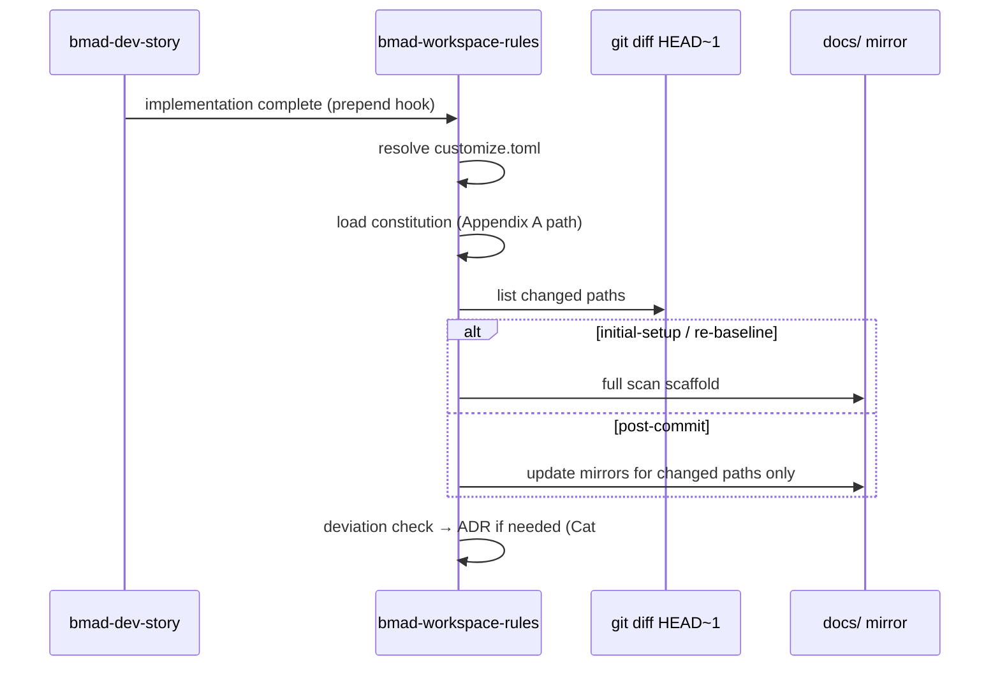

# R-07 — `bmad-workspace-rules` skill skeleton

## Goal

Define the skill package structure, activation flow, and config surface for the agent-first project documentation skill described in brainstorming.

## Research questions

| # | Question |
|---|----------|
| 1 | Workflow vs agent vs hybrid — which family fits post-`bmad-dev-story` automation? |
| 2 | What loads from consolidated brainstorm (Appendix A + B) vs `init.md` customize? |
| 3 | Tri-file constitution (#12) → single SKILL.md: what moves to `references/`? |
| 4 | Modes: `initial-setup`, `post-commit`, `re-baseline`, `surgical-strike` — one skill or menu? |
| 5 | How does `git diff HEAD~1` integration avoid full-repo scans (Cat #4, #8)? |

## Proposed skill layout (draft)

```
.agents/skills/bmad-workspace-rules/
├── SKILL.md                    # Entry, conventions, mode routing
├── customize.toml              # constitution path, docs paths, ADR folder, modes
├── references/
│   ├── constitution-loader.md  # How to read Appendix A precedence
│   ├── mirror-docs-rules.md    # Cat #3 layout and update rules
│   ├── surgical-strike.md      # Brownfield diff-only protocol (Cat #4)
│   ├── coverage-report.md      # Undocumented file surfacing format
│   └── helper-writer-router.md # Cat #22 — defer detail to R-12
└── assets/
    └── coverage-report-template.md
```

**Recommended family:** Complex **workflow** skill (not persona agent) with optional `customize.toml` hooks; triggered after `bmad-dev-story` via team override prepend step.

## Activation flow (draft)



## Config keys (`customize.toml` draft)

| Key | Purpose | Default from init.md |
|-----|---------|----------------------|
| `constitution_path` | Read-only standards | `_bmad-output/brainstorming/...-consolidated.md` (Appendix A) |
| `research_index_path` | Research backlog | `_bmad-output/research/research-index.md` |
| `docs_output_path` | Mirror root | `{project-root}/docs` |
| `adr_path` | Decision records | `{project-root}/docs/decisions` |
| `mode` | `initial-setup` \| `post-commit` \| `re-baseline` \| `surgical-strike` | `post-commit` |
| `max_files_per_session` | DX guardrail Cat #6 | TBD |
| `yolo_defaults_enabled` | Cat #2 | true |

## Modes

| Mode | When | Behavior |
|------|------|----------|
| `initial-setup` | First run / greenfield | Full structure scan, scaffold `docs/`, baseline coverage |
| `post-commit` | After `bmad-dev-story` | `git diff HEAD~1` → update mirrors for touched paths |
| `re-baseline` | Constitution changed | Re-align all mirror docs to new Appendix A |
| `surgical-strike` | Brownfield touch | Diff-only; no full tree walk (Cat #4) |

## Acceptance criteria

- [ ] `SKILL.md` passes BMad description format and conventions block
- [ ] `customize.toml` merges via `resolve_customization.py`
- [ ] Constitution path is read-only; conflicts route to ADR not silent merge
- [ ] Integration documented in `init.md` matches actual activation hooks
- [ ] R-01 anatomy rules applied (references carve-out, not bloated SKILL.md)

## Next steps

- [ ] Complete R-01 and R-08
- [ ] Run `bmad-workflow-builder` or `bmad-agent-builder` to generate skeleton from this brief
- [ ] Wire `_bmad/custom/bmad-workspace-rules.toml` from `init.md` prompt

## References

- `init.md` — project init prompt
- Brainstorm Cat #10 Init Ceremony, #12 Tri-File Constitution, #1 Workflow Compiler
- R-01, R-08, R-09, R-12
