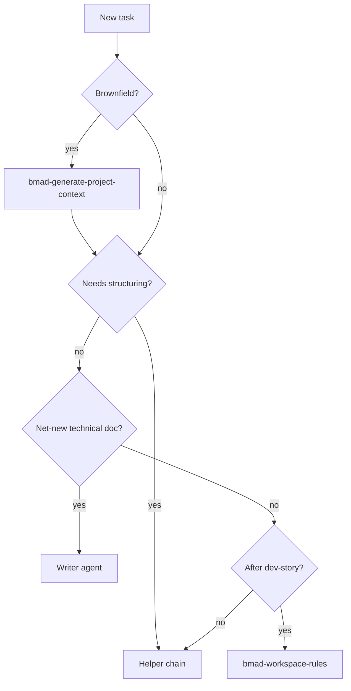

# R-12 — Helper-vs-Writer skill dispatcher

## Goal

Codify task classification so agents route to Helper chain vs Writer agents without guessing (Cat #22).

## Research questions

| # | Question |
|---|----------|
| 1 | Decision tree — single flowchart sufficient? |
| 2 | Brownfield always starts with `bmad-generate-project-context`? |
| 3 | Can Helpers run on code files or docs only? |
| 4 | How does dispatcher interact with `bmad-workspace-rules`? |

## Classification table (draft)

| User intent | Route | Skills |
|-------------|-------|--------|
| Unstructured notes → structured doc | Helper chain | prose → structure → shard → index |
| Compress long session / brainstorm | Helper | `bmad-distillator` |
| New API / module technical doc | Writer | `bmad-agent-tech-writer` or `bmad-document-project` |
| Unknown brownfield codebase | Writer (first) | `bmad-generate-project-context` |
| Post-implementation doc sync | Workspace rules | `bmad-workspace-rules` (not Helper) |
| Architecture deviation | ADR | manual + Cat #7 |

## Decision flow

## Acceptance criteria

- [ ] `references/helper-writer-router.md` in R-07 skill package
- [ ] Appendix B hints preserved but `name` + `description` remain source of truth
- [ ] Documented in `docs/engineering/ai-agent-guidelines.md`

## References

- Appendix B — BMAD Skills Registry
- Brainstorm Cat #22 Helper-vs-Writer Skill Router
- R-01 skill families
