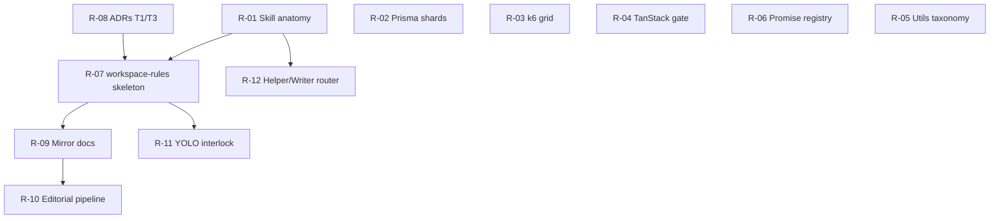

# Research Index — bmad-workspace-rules

**Purpose:** Structured research backlog derived from the 2026-05-19 brainstorming consolidation. Each topic has a dedicated brief under this folder. Close a topic when findings are documented, an ADR exists (if policy changes), or deferral has an explicit trigger.

**Source of truth for rules:** [`brainstorming-session-2026-05-19-consolidated.md`](../brainstorming/brainstorming-session-2026-05-19-consolidated.md)

---

## How to use this folder

1. Read this index for priority and dependencies.
2. Open the relevant `R-XX-*.md` brief before implementation or spikes.
3. Record findings in the brief; promote stable decisions to `docs/decisions/` or Appendix A via ADR.
4. Update `status` in the brief frontmatter and `pending_from_braindump` in the consolidated brainstorm when done.

---

## Priority tiers

| Tier | Topics | Rationale |
|------|--------|-----------|
| **P0 — unblock skill build** | R-01, R-07, R-08 | Skill anatomy + skeleton + ADRs for resolved tensions T1/T3 |
| **P1 — constitution implementation** | R-02, R-03, R-04, R-09 | Data layer, testing grid, frontend gate, mirror docs |
| **P2 — governance & UX** | R-05, R-06, R-10, R-11, R-12 | Utils taxonomy, promise policy, editorial automation, YOLO safety, routing |

---

## Topic registry

| ID | Brief | Priority | Status | Brainstorm cats | Blocked by |
|----|-------|----------|--------|-----------------|------------|
| R-01 | [R-01-bmad-skill-anatomy.md](./R-01-bmad-skill-anatomy.md) | P0 | closed | — | — |
| R-07 | [R-07-workspace-rules-skill-skeleton.md](./R-07-workspace-rules-skill-skeleton.md) | P0 | closed | #10, #12, #1 | R-01 |
| R-08 | [R-08-adrs-t1-t3.md](./R-08-adrs-t1-t3.md) | P0 | closed | #7, T1, T3 | — |
| R-02 | [R-02-prisma-schema-shards.md](./R-02-prisma-schema-shards.md) | P1 | closed | #14 | — |
| R-03 | [R-03-k6-perimeter-grid.md](./R-03-k6-perimeter-grid.md) | P1 | closed | #17 | — |
| R-04 | [R-04-tanstack-scaffold-gate.md](./R-04-tanstack-scaffold-gate.md) | P1 | closed | #18 | — |
| R-09 | [R-09-mirror-docs-cartographer.md](./R-09-mirror-docs-cartographer.md) | P1 | closed | #3, #8, #9 | R-07 |
| R-05 | [R-05-utility-taxonomy.md](./R-05-utility-taxonomy.md) | P2 | closed | #20 | — |
| R-06 | [R-06-promise-exception-registry.md](./R-06-promise-exception-registry.md) | P2 | closed | #15, T2 | — |
| R-10 | [R-10-editorial-pipeline-automation.md](./R-10-editorial-pipeline-automation.md) | P2 | closed | #19 | R-09 |
| R-11 | [R-11-yolo-safety-interlock.md](./R-11-yolo-safety-interlock.md) | P2 | closed | #2, #5, #6 | R-07 |
| R-12 | [R-12-helper-writer-dispatcher.md](./R-12-helper-writer-dispatcher.md) | P2 | closed | #22 | R-01 |

---

## Recommended execution order

**Phase 1 (now):** R-01 findings → R-08 ADR drafts → R-07 skill scaffold  
**Phase 2:** R-02, R-03, R-04 spikes in parallel  
**Phase 3:** R-09 mirror layout tied to `bmad-dev-story` hook  
**Phase 4:** R-05, R-06, R-10, R-11, R-12 polish and automation

---

## Closing criteria (all topics)

- [ ] Research questions answered or explicitly deferred with trigger
- [ ] Findings section filled with evidence (links, snippets, directory trees)
- [ ] Recommended implementation captured (paths, file names, checklist)
- [ ] Consolidated brainstorm Part 2 row updated; frontmatter `pending_from_braindump` if applicable
- [ ] ADR filed when changing constitution or team policy

---

## Outputs map (when complete)

| Research | Expected artifact |
|----------|-------------------|
| R-01 | `docs/engineering/bmad-skill-anatomy.md` |
| R-07 | `.agents/skills/bmad-workspace-rules/SKILL.md` + `customize.toml` |
| R-08 | `docs/decisions/001-shared-dto-package.md`, `002-repository-triad.md` |
| R-02 | `docs/engineering/prisma-multi-file-schema.md` + example `prisma/models/` |
| R-03 | `testing/load/{frontend,backend,microservices}/` scaffold + README |
| R-04 | Frontend scaffold checklist + `docs/engineering/frontend-tanstack-first.md` |
| R-09 | Mirror docs convention in skill + `docs/` layout spec |
| R-06 | `docs/decisions/promise-exceptions.md` |
